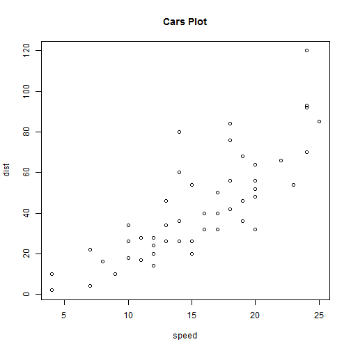

## Why the Vis-App?

1. The traditional Stock Data is too complicated to be observed by public, we need a more direct way to diliver the info to them; in the other hand, Census Data has the same problem. So I choose to visualize them by using R.
2. A intractive Visualizing App will allow users to gain more info form the origin data, so I give some parameters to users, which allow them to complete and visual their ideal plot of stock and census data. 
3. Last but the most important point is because I need to complete a project for **Developing Data Products** Course on Coursera, haha..Forgive me..:)

--- .class #id 

## What can it do?

* This is the demo effects of Vis-App. [Project Link](https://courseraassignment.shinyapps.io/Vis-App/)
* It can plot the specific stock history as well as the American Census Data in the way you like, you can choose different Data-Rnge, StockCode, Adjust prices for inflation or not, Different mode and so on.


---

## Structure of this App

Let's hae a look at the **sliderInput** of `ui.R`'s some part:

```
sliderInput("range", label = "Range of interest:", min = 0, max = 100, value = c(5, 90))
```

The effect of my Vis-App is quite like the codes show below, since my data is supported by a single file and github doesn't support this kind of showing, I just show the car part.


```r
summary(cars)
```

```
##      speed           dist       
##  Min.   : 4.0   Min.   :  2.00  
##  1st Qu.:12.0   1st Qu.: 26.00  
##  Median :15.0   Median : 36.00  
##  Mean   :15.4   Mean   : 42.98  
##  3rd Qu.:19.0   3rd Qu.: 56.00  
##  Max.   :25.0   Max.   :120.00
```

---

**Extend:** You can access more details at [Github](https://github.com/hijiangtao/R-Program-Series/tree/master/Developing%20Data%20Products/Vis-App) or [Vis-App](https://courseraassignment.shinyapps.io/Vis-App/)The foolowing codes shows my App's plot function theory.It's the extend of previours page.Thanks for watching!


```r
plot(cars, main="Cars Plot")
```

 
